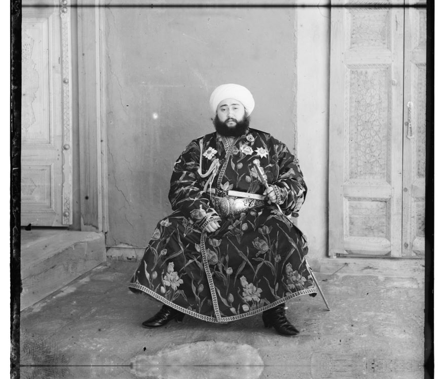
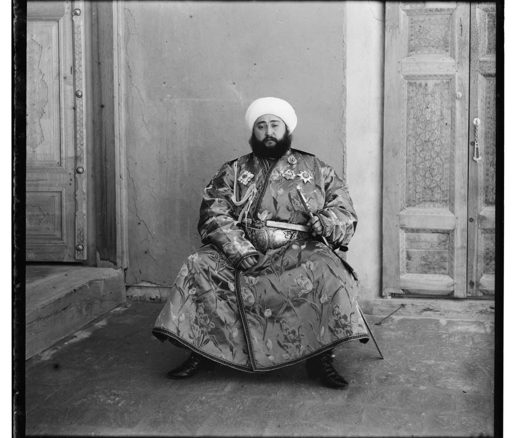
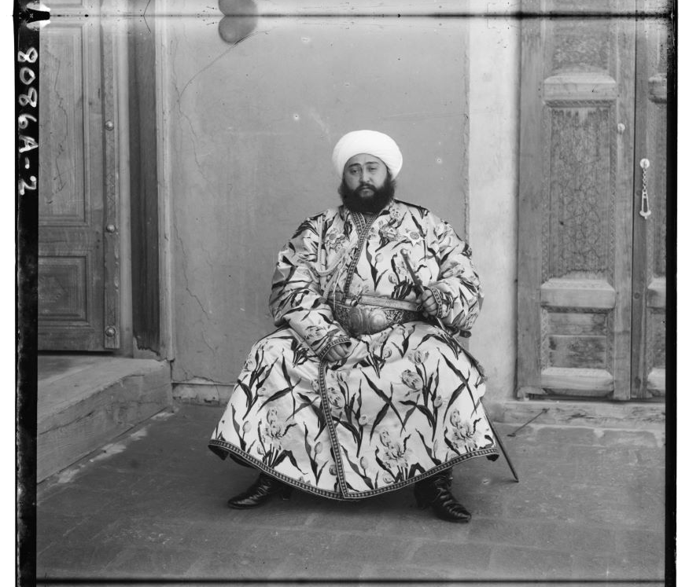
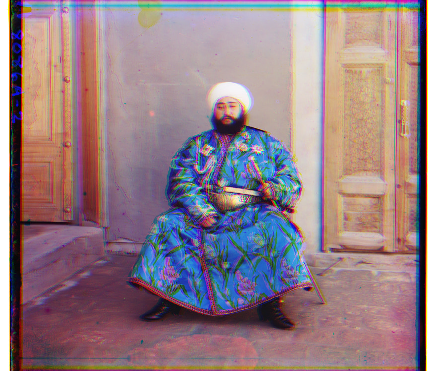
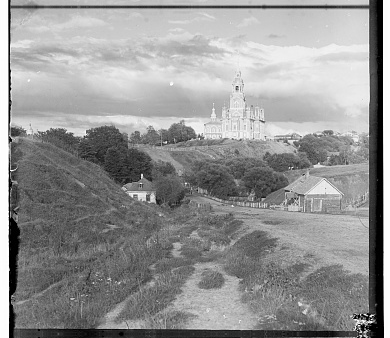
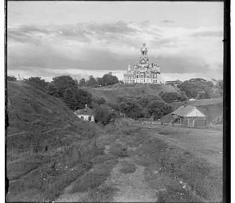
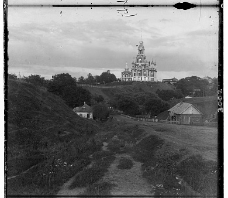
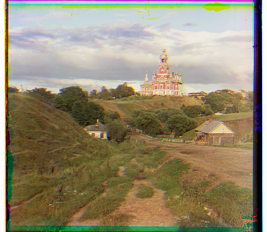

# Automated RGB Channel Identification and Channel Registration

### Keywords  
**Gray-scale Images** | **Statistical Analysis** | **Cropping** | **Channel Identification**  
**RGB Channels** | **Scene Registration** | **Error Metric** | **Channel Registration**  
**Complexity Reduction**

---

## Overview  

This project reconstructs colored images from grayscale channels captured in three exposures (red, green, and blue). Inspired by Sergei Mikhailovich Prokudin-Gorskii’s pioneering work, it leverages modern techniques to align and merge these channels into seamless RGB images. The result is a vibrant recreation of historical scenes, enabling a unique view of the past through computational imaging.

---

## Dataset  

The dataset contains:  
- **Input**: Grayscale images for red, green, and blue channels.  
- **Output**: Registered and aligned RGB images.  

These resources provide a foundation for automating channel alignment and color reconstruction.

---

## Methodology  

1. **Channel Identification**: Determine the corresponding RGB channel for each grayscale image.  
2. **Alignment**: Use statistical techniques to minimize misalignments and crop overlapping regions.  
3. **Reconstruction**: Merge aligned channels into a complete RGB image.

---

## Tools  

- **Python 3.x**  
- Libraries: NumPy, OpenCV, Matplotlib  

Install dependencies:  

```bash
pip install numpy opencv-python matplotlib
```

---

## Example Output  

<div style="display: flex; justify-content: center; align-items: center; flex-direction: row;">
  
  
  
   
</div>
<div style="display: flex; justify-content: center; align-items: center; flex-direction: row;">
  
  
  
   
</div>
Figure: Grayscale inputs (left) and reconstructed RGB output (right).

---

## Applications  

This approach has modern uses in:  
- Digital restoration of historical images.  
- Enhancing modern photography.  
- Aligning multi-band satellite or medical images.

---

## License  

This project is licensed under the MIT License.
