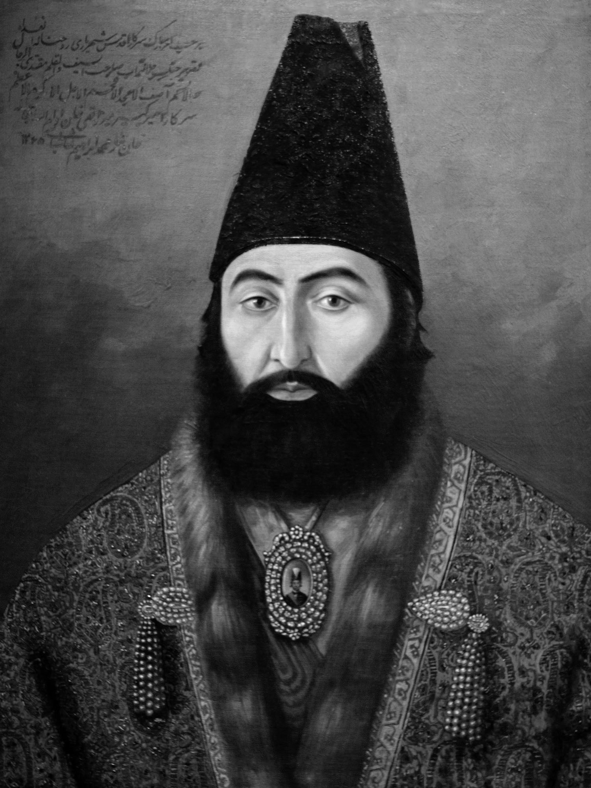
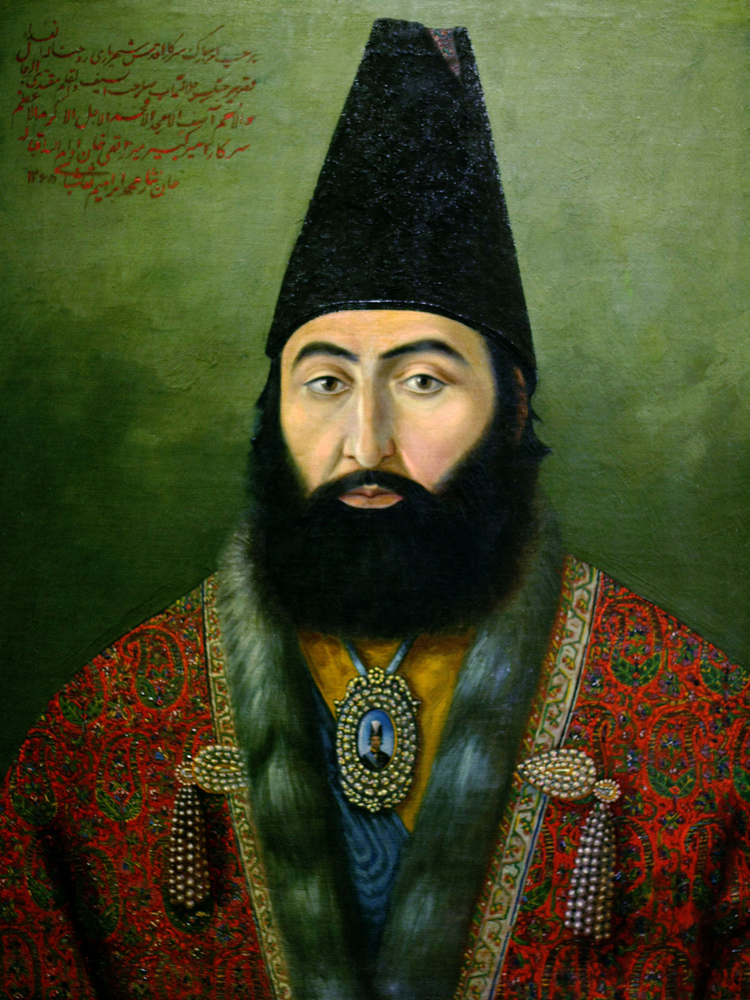

# Color Assimilation Project: Unlocking Color from Black and White

### Keywords  
**Color Assimilation** | **Grayscale Conversion** | **Visual Illusion** | **Color Perception** | **Optical Illusion** | **Visual Harmony** | **Illusion Creation**

---

## Overview

The **Color Assimilation Grid Illusion** is an ingenious technique that manipulates black and white images to create the perception of vibrant color. This project explores the fascinating interplay between visual perception and optical illusions.

By strategically overlaying colorful lines onto the original black-and-white picture, an illusion of color is generated. This mesmerizing effect captivates viewers, illustrating the complexities of human perception and the creative potential of optical illusions in art and design.

---

## Objective

The primary objective of this project is to:

- Showcase the powerful interplay between **grayscale images** and **color overlays**.
- Highlight how **optical illusions** can manipulate perception to "unlock" color where none exists.
- Demonstrate the creative potential of such techniques in visual media, art, and design.

---

## Key Components

1. **Color Assimilation Technique**  
   - Overlaying carefully designed colorful lines onto grayscale images to create the perception of full color.

2. **Visual Perception Studies**  
   - Investigating how the human brain processes color and how illusions can deceive visual interpretation.

3. **Applications in Art and Design**  
   - Using this illusion to create captivating artworks, advertisements, and visual storytelling tools.

---

## Sample Output

  
  
   

*Figure 1. Grayscale (left), Color Assimilation Circle Illusion Sample (center), Real RGB Image (right).*

This image demonstrates how black and white imagery can appear colorful through the application of color assimilation techniques.

---

## Significance

- Highlights the intricacies of human visual perception.
- Provides insight into the relationship between **color theory** and **psychology**.
- Sparks creative innovation in the realms of digital art and optical media.

---

**Acknowledgments**  
This project is inspired by ongoing research into color perception and optical illusions.

---

## License  

This project is licensed under the MIT License.

